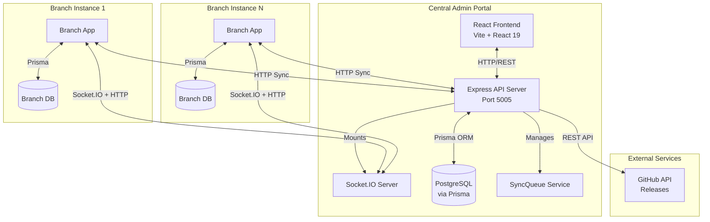
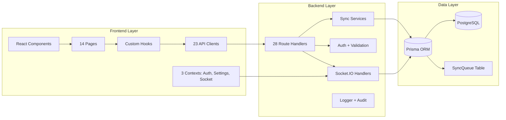
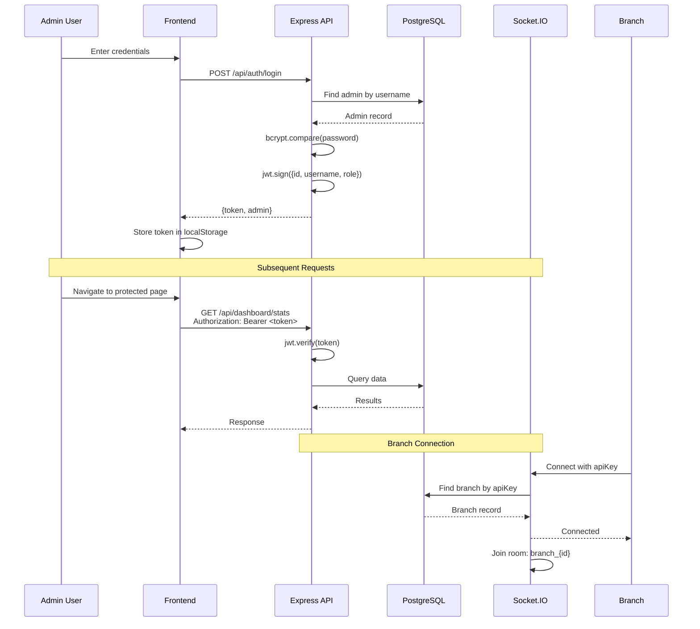
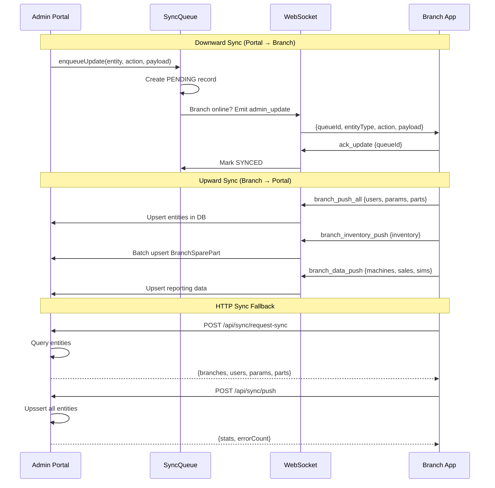
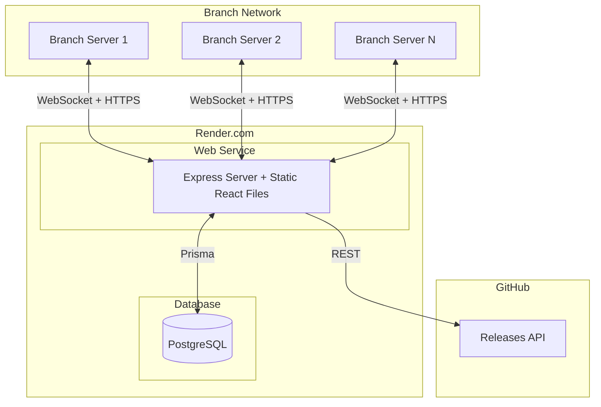
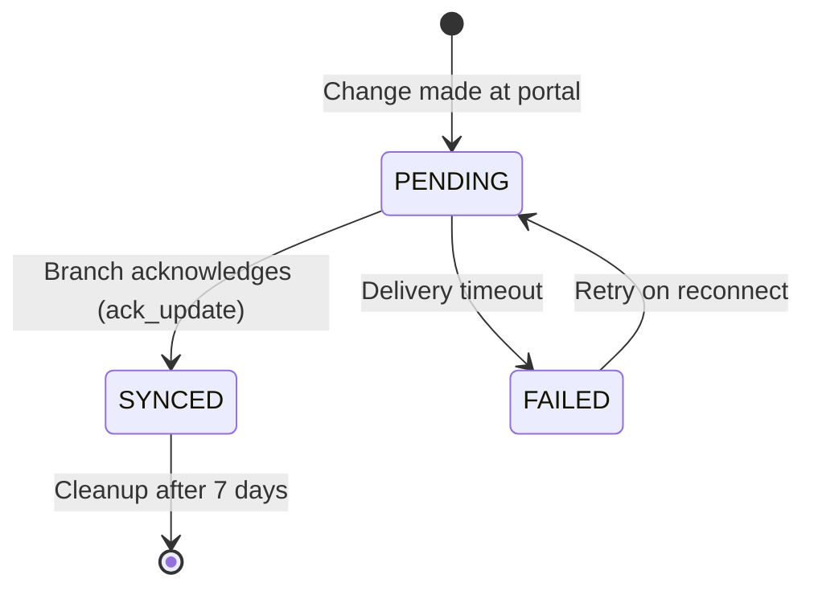

# Architecture — Smart Enterprise Central Admin Portal

## System Overview

Smart Enterprise Central Admin Portal is a **hub-and-spoke** management system that serves as the central authority for multiple branch instances. The portal manages branches, synchronizes data, distributes software updates, and enforces licensing across the entire enterprise.



## Component Architecture



## Authentication Architecture



## Data Sync Architecture



## Deployment Architecture



## Directory Structure

```
SmartEnterprise_AD/
├── backend/
│   ├── server.js                    # Express + Socket.IO entry point
│   ├── db.js                        # Prisma client singleton
│   ├── src/
│   │   ├── routes/                  # 28 route handlers
│   │   │   ├── auth.js              # Authentication (login, password reset)
│   │   │   ├── branches.js          # Branch CRUD + registration
│   │   │   ├── sync.js              # HTTP sync endpoints
│   │   │   ├── licenses.js          # License lifecycle
│   │   │   ├── versions.js          # Version management + GitHub
│   │   │   └── ...                  # 23 more route files
│   │   ├── services/
│   │   │   ├── syncQueue.service.js # Queue-based sync service
│   │   │   └── branchSync.service.js
│   │   ├── sockets/
│   │   │   └── admin.socket.js      # WebSocket event handlers
│   │   ├── middleware/
│   │   │   ├── auth.js              # JWT + role guards
│   │   │   └── validate.js          # Zod validation
│   │   └── utils/
│   │       ├── logger.js            # Pino logger
│   │       └── auditLogger.js       # Audit trail
│   └── prisma/
│       └── schema.prisma            # 34 models
│
├── frontend/
│   └── src/
│       ├── App.tsx                  # React Router + auth wrapper
│       ├── main.tsx                 # Vite bootstrap
│       ├── api/                     # 23 API client modules
│       ├── pages/                   # 14 page components
│       ├── components/              # Layout + UI components
│       ├── context/                 # Auth, Settings, Socket
│       └── hooks/                   # Custom React hooks
│
└── docs/                            # This documentation
```

## Key Design Patterns

### 1. SyncQueue Pattern
Changes made at the portal are queued in the `SyncQueue` table and delivered to branches via WebSocket. If a branch is offline, updates accumulate and are pushed when the branch reconnects.



### 2. Dual Authentication
- **Admin Users**: JWT tokens (24h expiry) via `Authorization: Bearer <token>`
- **Branch Apps**: API keys (non-expiring) via `x-portal-sync-key` header
- Socket.IO supports both: branches use `apiKey`, admins use `token`

### 3. Source of Truth Hierarchy
- **Portal is source of truth for**: Spare parts catalog, machine parameters, global parameters, software versions
- **Branches are source of truth for**: Customers, POS machines, maintenance requests, payments, warehouse inventory
- **Bidirectional sync**: Users sync both ways with conflict resolution

### 4. RBAC System
8 hardcoded roles with granular permissions stored in `RolePermission` model:
- `SUPER_ADMIN` — Full access
- `MANAGEMENT` — Management operations
- `BRANCH_ADMIN` — Branch administration
- `ACCOUNTANT` — Financial operations
- `BRANCH_MANAGER` — Branch management
- `CS_SUPERVISOR` — Customer service supervision
- `CS_AGENT` — Customer service operations
- `BRANCH_TECH` — Technical operations

### 5. Bootstrap Registration Flow
New branches self-register through a 3-step process:
1. `POST /api/branches/register` — Creates branch with bootstrap secret
2. `POST /api/branches/verify-registration` — Confirms branch code
3. `POST /api/branches/complete-registration` — Binds HWID, activates branch

## Technology Stack

| Layer | Technology | Version |
|-------|-----------|---------|
| Frontend Framework | React | 19.x |
| Build Tool | Vite | 7.x |
| Language | TypeScript | 5.9.x |
| State Management | TanStack React Query | 5.x |
| UI Primitives | Radix UI | 1.x |
| Styling | Tailwind CSS | 4.x |
| Routing | React Router DOM | 7.x |
| Backend Framework | Express | 4.x |
| Runtime | Node.js (CommonJS) | — |
| ORM | Prisma | 5.x |
| Database | PostgreSQL | — |
| Real-time | Socket.IO | 4.x |
| Validation | Zod | 4.x |
| Auth | jsonwebtoken | 9.x |
| Logging | Pino | 10.x |
| Testing | Jest + Supertest | 30.x |
