# Database Schema — Smart Enterprise Central Admin Portal

**Database:** PostgreSQL
**ORM:** Prisma 5.x
**Schema File:** `backend/prisma/schema.prisma` (769 lines)
**Total Models:** 47

## Entity Relationship Diagram

```mermaid
erDiagram
    Branch ||--o{ User : has
    Branch ||--o{ Customer : has
    Branch ||--o{ PosMachine : has
    Branch ||--o{ SimCard : has
    Branch ||--o{ WarehouseMachine : has
    Branch ||--o{ WarehouseSim : has
    Branch ||--o{ MaintenanceRequest : receives
    Branch ||--o{ MachineSale : has
    Branch ||--o{ Payment : has
    Branch ||--o{ StockMovement : tracks
    Branch ||--o{ BranchSparePart : stocks
    Branch ||--o{ SyncQueue : queues
    Branch ||--o{ PortalSyncLog : logs
    Branch ||--o{ BranchBackup : has
    Branch ||--o{ Installment : has
    Branch ||--o{ Notification : sends
    Branch ||--o{ MachineMovementLog : tracks
    Branch ||--o{ SystemLog : logs
    Branch ||--o{ UsedPartLog : tracks
    Branch ||--o{ MaintenanceApproval : approves
    Branch }o--o{ Branch : parent-child

    Customer ||--o{ MachineSale : makes
    Customer ||--o{ MaintenanceRequest : submits
    Customer ||--o{ Payment : makes
    Customer ||--o{ PosMachine : owns
    Customer ||--o{ SimCard : owns
    Customer ||--o{ WarehouseMachine : owns

    MasterSparePart ||--o{ BranchSparePart : stocked_at
    MasterSparePart ||--o{ SparePartPriceLog : has
    MasterSparePart ||--o{ StockMovement : tracks

    MaintenanceRequest ||--o{ Payment : generates
    MaintenanceRequest ||--o{ StockMovement : uses
    MaintenanceRequest ||--o{ MaintenanceApproval : requires

    MachineSale ||--o{ Installment : has

    TransferOrder ||--o{ TransferOrderItem : contains
    Branch ||--o{ TransferOrder : sends
    Branch ||--o{ TransferOrder : receives

    User ||--o{ RefreshToken : has
    User ||--o{ PasswordHistory : tracks
    User ||--o{ AccountLockout : may_have

    AdminItemType ||--o{ AdminAsset : categorizes
    AdminItemType ||--o{ AdminStock : tracks
    AdminCarton ||--o{ AdminAsset : contains
    AdminAsset ||--o{ AdminAssetHistory : tracks

    License ||--o{ LicenseAudit : audits

    AdminUser
    GlobalParameter
    BranchBackup
    Release
    CentralLog
    AuditLog
    AdminItemType
    AdminAsset
    AdminCarton
    AdminAssetHistory
    AdminStock
    SystemSetting
    SyncQueue
    MachineParameter
    MasterSparePart
    SparePartPriceLog
    BranchSparePart
    User
    RefreshToken
    Branch
    Customer
    MaintenanceRequest
    TransferOrder
    TransferOrderItem
    UsedPartLog
    StockMovement
    Payment
    MachineMovementLog
    SystemLog
    PasswordHistory
    AccountLockout
    Installment
    MachineSale
    Notification
    PosMachine
    RolePermission
    SimCard
    SimMovementLog
    WarehouseMachine
    WarehouseSim
    MaintenanceApproval
    ClientType
    PortalSyncLog
    BranchVersion
    VersionLog
    GitHubSettings
    License
    LicenseAudit
    UserSyncLog
```

## Models by Domain

### Identity & Access

#### AdminUser
Portal administrator accounts.

| Field | Type | Constraints | Description |
|-------|------|-------------|-------------|
| id | String | PK, cuid() | Unique identifier |
| username | String | Unique | Login username |
| passwordHash | String | Required | Bcrypt hashed password |
| name | String? | — | Display name |
| role | String | Default: SUPER_ADMIN | Admin role |
| recoveryKey | String? | — | Password recovery key |
| resetPasswordToken | String? | — | Active reset token |
| resetPasswordExpires | DateTime? | — | Reset token expiry |
| mfaEnabled | Boolean | Default: false | MFA enabled flag |
| mfaSetupPending | Boolean | Default: false | MFA setup in progress |
| mfaTempSecret | String? | — | Temporary MFA secret |
| mfaRecoveryCodes | String? | — | Backup recovery codes |
| preferences | Json? | — | User preferences (theme, font) |
| createdAt | DateTime | Default: now() | Creation timestamp |
| updatedAt | DateTime | Auto-update | Last modification |

#### User
Branch-level user accounts.

| Field | Type | Constraints | Description |
|-------|------|-------------|-------------|
| id | String | PK, cuid() | Unique identifier |
| uid | String? | Unique | External UID |
| username | String? | Unique | Login username |
| email | String? | Unique | Email address |
| displayName | String? | — | Display name |
| role | String? | Default: CS_AGENT | User role |
| password | String? | — | Bcrypt hashed password |
| branchId | String? | FK → Branch | Owning branch |
| isActive | Boolean | Default: true | Account active |
| mfaEnabled | Boolean | Default: false | MFA enabled |
| mustChangePassword | Boolean | Default: false | Force password change |
| loginCount | Int | Default: 0 | Total logins |
| lastLoginAt | DateTime? | — | Last login timestamp |
| theme | String? | Default: light | UI theme preference |
| fontFamily | String? | Default: sans-serif | Font preference |
| notificationSound | Boolean | Default: true | Sound alerts |
| mobilePush | Boolean | Default: false | Push notifications |

#### RolePermission
RBAC permission matrix.

| Field | Type | Constraints | Description |
|-------|------|-------------|-------------|
| id | String | PK, cuid() | Unique identifier |
| role | String | — | Role name |
| permissionType | String | — | Permission category |
| permissionKey | String | — | Permission identifier |
| isAllowed | Boolean | Default: true | Grant/deny |

**Composite Unique:** `[role, permissionType, permissionKey]`

#### RefreshToken
JWT refresh tokens.

| Field | Type | Constraints | Description |
|-------|------|-------------|-------------|
| id | String | PK, cuid() | Unique identifier |
| token | String | Unique | Token value |
| userId | String | FK → User | Token owner |
| expiresAt | DateTime | — | Token expiry |

#### PasswordHistory
Tracks previous passwords to prevent reuse.

| Field | Type | Constraints | Description |
|-------|------|-------------|-------------|
| id | String | PK, cuid() | Unique identifier |
| userId | String | FK → User | User |
| passwordHash | String | — | Previous password hash |

**Indexes:** `[userId]`, `[createdAt]`

#### AccountLockout
Tracks failed login attempts and lockouts.

| Field | Type | Constraints | Description |
|-------|------|-------------|-------------|
| id | String | PK, cuid() | Unique identifier |
| userId | String | Unique, FK → User | Locked user |
| failedAttempts | Int | Default: 0 | Failed login count |
| lastFailedAttempt | DateTime? | — | Last failure time |
| lockedUntil | DateTime? | — | Lockout expiry |

**Indexes:** `[userId]`, `[lockedUntil]`

---

### Branch Management

#### Branch
Branch offices — the core entity of the hub-and-spoke architecture.

| Field | Type | Constraints | Description |
|-------|------|-------------|-------------|
| id | String | PK, cuid() | Unique identifier |
| code | String | Unique | Branch code (e.g., BR001) |
| name | String | Required | Branch name |
| type | String | Default: BRANCH | Branch type |
| status | String | Default: OFFLINE | Connection status |
| isActive | Boolean | Default: true | Active flag |
| apiKey | String? | Unique | Branch API key for sync |
| authorizedHWID | String? | — | Hardware ID binding |
| url | String? | — | Branch server URL |
| lastSeen | DateTime? | — | Last connection time |
| version | String? | — | App version |
| address | String? | — | Physical address |
| phone | String? | — | Contact phone |
| managerEmail | String? | — | Manager email |
| parentBranchId | String? | FK → Branch | Parent branch (hierarchy) |
| maintenanceCenterId | String? | — | Maintenance center FK |

**Self-referencing:** `parentBranch → childBranches` (BranchHierarchy relation)

#### BranchBackup
Backup records for branches.

| Field | Type | Constraints | Description |
|-------|------|-------------|-------------|
| id | String | PK, cuid() | Unique identifier |
| branchId | String | FK → Branch | Branch |
| filename | String | — | Backup file name |
| size | Int | — | File size in bytes |
| url | String | — | Download URL |

---

### Customer & Sales

#### Customer
Client/customer records.

| Field | Type | Constraints | Description |
|-------|------|-------------|-------------|
| id | String | PK, cuid() | Unique identifier |
| bkcode | String | Unique | Business code |
| client_name | String | Required | Customer name |
| branchId | String? | FK → Branch | Owning branch |
| supply_office | String? | — | Supply office |
| operating_date | DateTime? | — | Operating since |
| address | String? | — | Address |
| contact_person | String? | — | Contact person |
| national_id | String? | — | National ID |
| telephone_1 | String? | — | Primary phone |
| telephone_2 | String? | — | Secondary phone |
| has_gates | Boolean? | Default: false | Has gates |
| bk_type | String? | — | Business type |
| clienttype | String? | — | Client type |
| status | String? | Default: Active | Status |
| isSpecial | Boolean? | Default: false | Special customer |
| notes | String? | — | Notes |

#### MachineSale
Machine sales records.

| Field | Type | Constraints | Description |
|-------|------|-------------|-------------|
| id | String | PK, cuid() | Unique identifier |
| serialNumber | String | Required | Machine serial |
| customerId | String | FK → Customer | Buyer |
| branchId | String? | FK → Branch | Selling branch |
| saleDate | DateTime | Default: now() | Sale date |
| type | String | Required | CASH or INSTALLMENT |
| totalPrice | Float | Required | Total price |
| paidAmount | Float | Required | Amount paid |
| status | String | Required | Sale status |
| notes | String? | — | Notes |

#### Installment
Payment installments for installment sales.

| Field | Type | Constraints | Description |
|-------|------|-------------|-------------|
| id | String | PK, cuid() | Unique identifier |
| saleId | String | FK → MachineSale | Parent sale |
| branchId | String? | FK → Branch | Branch |
| dueDate | DateTime | Required | Due date |
| amount | Float | Required | Installment amount |
| isPaid | Boolean | Default: false | Paid flag |
| paidAt | DateTime? | — | Payment date |
| receiptNumber | String? | — | Receipt number |
| paymentPlace | String? | — | Payment location |
| paidAmount | Float? | — | Amount paid |

---

### Maintenance

#### MaintenanceRequest
Service/repair tickets.

| Field | Type | Constraints | Description |
|-------|------|-------------|-------------|
| id | String | PK, cuid() | Unique identifier |
| customerId | String | FK → Customer | Customer |
| posMachineId | String? | FK → PosMachine | Machine |
| branchId | String? | FK → Branch | Requesting branch |
| servicedByBranchId | String? | — | Servicing branch |
| status | String | Default: Open | Request status |
| type | String? | — | Request type |
| description | String? | — | Description |
| complaint | String? | — | Customer complaint |
| actionTaken | String? | — | Action taken |
| technician | String? | — | Assigned technician |
| totalCost | Float? | Default: 0 | Total cost |
| receiptNumber | String? | — | Receipt number |
| usedParts | String? | — | Parts used (JSON) |
| closingUserId | String? | — | Closing user ID |
| closingTimestamp | DateTime? | — | Closing time |

#### MaintenanceApproval
Cost approval workflow for maintenance requests.

| Field | Type | Constraints | Description |
|-------|------|-------------|-------------|
| id | String | PK, cuid() | Unique identifier |
| requestId | String | FK → MaintenanceRequest | Request |
| branchId | String? | FK → Branch | Branch |
| cost | Float | Required | Approved cost |
| parts | String? | — | Parts needed |
| status | String | Default: PENDING | Approval status |
| respondedBy | String? | — | Responder |
| respondedAt | DateTime? | — | Response time |

---

### Inventory & Stock

#### MasterSparePart
Global spare part catalog (source of truth).

| Field | Type | Constraints | Description |
|-------|------|-------------|-------------|
| id | String | PK, cuid() | Unique identifier |
| partNumber | String? | Unique | Part number |
| name | String | Required | Part name |
| description | String? | — | Description |
| compatibleModels | String? | — | Compatible models |
| defaultCost | Float | Default: 0 | Default cost |
| isConsumable | Boolean | Default: false | Consumable flag |
| category | String? | — | Category |
| allowsMultiple | Boolean | Default: false | Multiple allowed |
| maxQuantity | Int | Default: 1 | Max quantity |

#### BranchSparePart
Per-branch spare part stock levels.

| Field | Type | Constraints | Description |
|-------|------|-------------|-------------|
| id | String | PK, cuid() | Unique identifier |
| branchId | String | FK → Branch | Branch |
| partId | String | FK → MasterSparePart | Part |
| quantity | Int | Default: 0 | Stock quantity |

**Composite Unique:** `[branchId, partId]`

#### SparePartPriceLog
Price change history for spare parts.

| Field | Type | Constraints | Description |
|-------|------|-------------|-------------|
| id | String | PK, cuid() | Unique identifier |
| partId | String | FK → MasterSparePart | Part |
| oldCost | Float | — | Previous cost |
| newCost | Float | — | New cost |
| changedBy | String? | — | Changed by user |

#### StockMovement
Spare part stock movement tracking.

| Field | Type | Constraints | Description |
|-------|------|-------------|-------------|
| id | String | PK, cuid() | Unique identifier |
| partId | String | FK → MasterSparePart | Part |
| branchId | String? | FK → Branch | Branch |
| requestId | String? | FK → MaintenanceRequest | Related request |
| type | String | Required | Movement type |
| quantity | Int | Required | Quantity |
| reason | String? | — | Reason |
| isPaid | Boolean? | Default: false | Paid flag |
| receiptNumber | String? | — | Receipt number |
| performedBy | String? | — | Performed by |

#### WarehouseMachine
Warehouse machine inventory.

| Field | Type | Constraints | Description |
|-------|------|-------------|-------------|
| id | String | PK, cuid() | Unique identifier |
| serialNumber | String | Unique | Serial number |
| model | String? | — | Model |
| manufacturer | String? | — | Manufacturer |
| status | String | Default: NEW | Status |
| branchId | String? | FK → Branch | Branch |
| customerId | String? | FK → Customer | Customer |
| requestId | String? | FK → MaintenanceRequest | Related request |
| importDate | DateTime | Default: now() | Import date |
| readyForPickup | Boolean | Default: false | Ready for pickup |

#### WarehouseSim
Warehouse SIM card inventory.

| Field | Type | Constraints | Description |
|-------|------|-------------|-------------|
| id | String | PK, cuid() | Unique identifier |
| serialNumber | String | Unique | Serial number |
| type | String? | — | SIM type |
| networkType | String? | — | Network type |
| status | String | Default: NEW | Status |
| branchId | String? | FK → Branch | Branch |

---

### POS Machines & SIM Cards

#### PosMachine
POS machine registry.

| Field | Type | Constraints | Description |
|-------|------|-------------|-------------|
| id | String | PK, cuid() | Unique identifier |
| serialNumber | String | Unique | Serial number |
| posId | String? | — | POS ID |
| model | String? | — | Model |
| manufacturer | String? | — | Manufacturer |
| customerId | String? | FK → Customer | Owner |
| branchId | String? | FK → Branch | Branch |

#### SimCard
SIM card registry.

| Field | Type | Constraints | Description |
|-------|------|-------------|-------------|
| id | String | PK, cuid() | Unique identifier |
| serialNumber | String | Unique | Serial number |
| type | String? | — | SIM type |
| networkType | String? | — | Network type |
| customerId | String? | FK → Customer | Owner |
| branchId | String? | FK → Branch | Branch |

#### SimMovementLog
SIM movement tracking.

| Field | Type | Constraints | Description |
|-------|------|-------------|-------------|
| id | String | PK, cuid() | Unique identifier |
| simId | String | Required | SIM ID |
| serialNumber | String | Required | Serial number |
| action | String | Required | Action type |
| branchId | String? | FK → Branch | Branch |
| performedBy | String? | — | Performed by |

#### MachineMovementLog
Machine movement tracking.

| Field | Type | Constraints | Description |
|-------|------|-------------|-------------|
| id | String | PK, cuid() | Unique identifier |
| serialNumber | String | Required | Serial number |
| action | String | Required | Action type |
| branchId | String? | FK → Branch | Branch |
| performedBy | String? | — | Performed by |

---

### Financial

#### Payment
Financial payment records.

| Field | Type | Constraints | Description |
|-------|------|-------------|-------------|
| id | String | PK, cuid() | Unique identifier |
| customerId | String? | FK → Customer | Customer |
| requestId | String? | FK → MaintenanceRequest | Related request |
| branchId | String? | FK → Branch | Branch |
| amount | Float | Required | Payment amount |
| type | String? | — | Payment type |
| paymentMethod | String? | — | Payment method |
| receiptNumber | String? | — | Receipt number |
| paymentPlace | String? | — | Payment location |
| userName | String? | — | User name |

---

### Transfers

#### TransferOrder
Inter-branch transfer orders.

| Field | Type | Constraints | Description |
|-------|------|-------------|-------------|
| id | String | PK, cuid() | Unique identifier |
| orderNumber | String | Unique | Order number |
| waybillNumber | String? | — | Waybill number |
| fromBranchId | String | FK → Branch | Source branch |
| toBranchId | String | FK → Branch | Destination branch |
| status | String | Default: PENDING | Transfer status |
| type | String | Required | Transfer type |
| driverName | String? | — | Driver name |
| driverPhone | String? | — | Driver phone |
| receivedAt | DateTime? | — | Received time |
| rejectionReason | String? | — | Rejection reason |

#### TransferOrderItem
Items within a transfer order.

| Field | Type | Constraints | Description |
|-------|------|-------------|-------------|
| id | String | PK, cuid() | Unique identifier |
| transferOrderId | String | FK → TransferOrder | Parent order |
| serialNumber | String? | — | Serial number |
| type | String? | — | Item type |
| model | String? | — | Model |
| manufacturer | String? | — | Manufacturer |
| isReceived | Boolean | Default: false | Received flag |

---

### Sync & Version Management

#### SyncQueue
Pending sync operations for branches.

| Field | Type | Constraints | Description |
|-------|------|-------------|-------------|
| id | String | PK, cuid() | Unique identifier |
| branchId | String | FK → Branch | Target branch |
| entityType | String | Required | Entity type |
| action | String | Required | Action type |
| payload | String | Required | JSON payload |
| status | String | Default: PENDING | PENDING/SYNCED/FAILED |
| error | String? | — | Error message |

#### PortalSyncLog
Portal-branch sync operation logs.

| Field | Type | Constraints | Description |
|-------|------|-------------|-------------|
| id | String | PK, cuid() | Unique identifier |
| branchId | String? | FK → Branch | Branch |
| branchCode | String? | — | Branch code |
| type | String | Required | PULL/PUSH/CONNECT/DISCONNECT |
| status | String | Required | SUCCESS/FAILED/PENDING |
| message | String | Required | Log message |
| itemCount | Int | Default: 0 | Items synced |
| details | String? | — | Additional details |

#### BranchVersion
Branch application version tracking.

| Field | Type | Constraints | Description |
|-------|------|-------------|-------------|
| id | String | PK, cuid() | Unique identifier |
| branchCode | String | Unique | Branch code |
| appVersion | String | Default: 1.0.0 | Current version |
| lastChecked | DateTime | Default: now() | Last check time |
| lastUpdated | DateTime? | — | Last update time |
| updateStatus | String | Default: up_to_date | Status |

#### VersionLog
Version update history.

| Field | Type | Constraints | Description |
|-------|------|-------------|-------------|
| id | String | PK, cuid() | Unique identifier |
| branchCode | String | Required | Branch code |
| action | String | Required | check/force_push/rollback |
| fromVersion | String? | — | Previous version |
| toVersion | String? | — | New version |
| status | String | Required | success/failed/in_progress |
| errorMessage | String? | — | Error message |
| initiatedBy | String? | — | Initiated by |
| downloadProgress | Int? | Default: 0 | Download % |
| installProgress | Int? | Default: 0 | Install % |

**Indexes:** `[branchCode]`, `[createdAt]`, `[status]`

#### GitHubSettings
GitHub integration configuration.

| Field | Type | Constraints | Description |
|-------|------|-------------|-------------|
| id | String | PK, cuid() | Unique identifier |
| patToken | String | Required | GitHub PAT |
| repoOwner | String | Default: mkamel30 | Repository owner |
| repoName | String | Default: SmartEnterprise_BR | Repository name |
| autoCheck | Boolean | Default: true | Auto-check updates |
| checkInterval | Int | Default: 3600 | Check interval (seconds) |

#### Release
Software release versions.

| Field | Type | Constraints | Description |
|-------|------|-------------|-------------|
| id | String | PK, cuid() | Unique identifier |
| version | String | Unique | Version string |
| description | String? | — | Release notes |
| url | String | Required | Download URL |
| severity | Int | Default: 5 | Severity level |
| isCurrent | Boolean | Default: false | Current release |

---

### Licensing

#### License
Software license keys.

| Field | Type | Constraints | Description |
|-------|------|-------------|-------------|
| id | String | PK, cuid() | Unique identifier |
| licenseKey | String | Unique | License key (XXXXX-XXXXX-XXXXX-XXXXX) |
| branchCode | String? | — | Assigned branch |
| branchName | String? | — | Branch name |
| hwid | String? | — | Hardware ID binding |
| machineId | String? | — | Machine ID |
| type | String | Default: BRANCH | License type |
| status | String | Default: ACTIVE | ACTIVE/SUSPENDED/REVOKED/EXPIRED |
| activationDate | DateTime? | — | Activation date |
| expirationDate | DateTime? | — | Expiration date |
| maxActivations | Int | Default: 1 | Max activations |
| activationCount | Int | Default: 0 | Current activations |
| lastVerifiedAt | DateTime? | — | Last verification |

**Indexes:** `[licenseKey]`, `[branchCode]`, `[hwid]`, `[status]`

#### LicenseAudit
License action audit trail.

| Field | Type | Constraints | Description |
|-------|------|-------------|-------------|
| id | String | PK, cuid() | Unique identifier |
| licenseId | String? | — | License ID |
| licenseKey | String | Required | License key |
| action | String | Required | CREATED/ACTIVATED/VERIFIED/SUSPENDED/REVOKED/HWID_MISMATCH |
| branchCode | String? | — | Branch code |
| hwid | String? | — | Hardware ID |
| ipAddress | String? | — | IP address |
| userAgent | String? | — | User agent |
| performedBy | String? | — | Performed by |

**Indexes:** `[licenseId]`, `[licenseKey]`, `[createdAt]`

---

### Admin Store

#### AdminItemType
Categories for admin store items.

| Field | Type | Constraints | Description |
|-------|------|-------------|-------------|
| id | String | PK, cuid() | Unique identifier |
| code | String | Unique | Item type code |
| name | String | Required | Item type name |
| category | String? | — | Category |
| requiresSerial | Boolean | Default: true | Requires serial tracking |

#### AdminAsset
Tracked assets in admin store.

| Field | Type | Constraints | Description |
|-------|------|-------------|-------------|
| id | String | PK, cuid() | Unique identifier |
| serialNumber | String | Unique | Asset serial number |
| itemTypeCode | String | FK → AdminItemType | Item type |
| status | String | Default: AVAILABLE | Asset status |
| cartonId | String? | FK → AdminCarton | Containing carton |
| currentBranchId | String? | — | Current branch location |

#### AdminCarton
Asset containers.

| Field | Type | Constraints | Description |
|-------|------|-------------|-------------|
| id | String | PK, cuid() | Unique identifier |
| cartonCode | String | Unique | Carton code |
| status | String | Default: AVAILABLE | Carton status |

#### AdminAssetHistory
Asset movement history.

| Field | Type | Constraints | Description |
|-------|------|-------------|-------------|
| id | String | PK, cuid() | Unique identifier |
| assetId | String | FK → AdminAsset (Cascade) | Asset |
| action | String | Required | Action type |
| fromBranchId | String? | — | Source branch |
| toBranchId | String? | — | Destination branch |

#### AdminStock
Per-branch stock counts for admin items.

| Field | Type | Constraints | Description |
|-------|------|-------------|-------------|
| id | String | PK, cuid() | Unique identifier |
| itemTypeCode | String | FK → AdminItemType | Item type |
| branchId | String | Required | Branch |
| quantity | Int | Default: 0 | Stock quantity |

**Composite Unique:** `[itemTypeCode, branchId]`

---

### Configuration & Logging

#### GlobalParameter
System-wide key-value configuration.

| Field | Type | Constraints | Description |
|-------|------|-------------|-------------|
| id | String | PK, cuid() | Unique identifier |
| key | String | Unique | Parameter key |
| value | String | Required | Parameter value |
| type | String | Default: STRING | Value type |
| group | String? | — | Parameter group |

#### SystemSetting
System key-value settings.

| Field | Type | Constraints | Description |
|-------|------|-------------|-------------|
| id | String | PK, cuid() | Unique identifier |
| key | String | Unique | Setting key |
| value | String | Required | Setting value |
| description | String? | — | Description |

#### MachineParameter
POS machine model definitions.

| Field | Type | Constraints | Description |
|-------|------|-------------|-------------|
| id | String | PK, cuid() | Unique identifier |
| prefix | String | Unique | Model prefix |
| model | String | Required | Model name |
| manufacturer | String | Required | Manufacturer |

#### ClientType
Customer type categories.

| Field | Type | Constraints | Description |
|-------|------|-------------|-------------|
| id | String | PK, cuid() | Unique identifier |
| name | String | Required | Type name |
| description | String? | — | Description |
| isActive | Boolean | Default: true | Active flag |

#### AuditLog
User action audit trail.

| Field | Type | Constraints | Description |
|-------|------|-------------|-------------|
| id | String | PK, cuid() | Unique identifier |
| userId | String? | — | User ID |
| userName | String? | — | User name |
| entityType | String | Required | Entity type |
| entityId | String? | — | Entity ID |
| action | String | Required | Action performed |
| details | String? | — | Action details |
| ipAddress | String? | — | IP address |
| userAgent | String? | — | User agent |

#### CentralLog
System-wide log entries.

| Field | Type | Constraints | Description |
|-------|------|-------------|-------------|
| id | String | PK, cuid() | Unique identifier |
| level | String | Default: INFO | Log level |
| message | String | Required | Log message |
| source | String? | — | Log source |
| context | String? | — | JSON context |

#### SystemLog
Branch-level system logs.

| Field | Type | Constraints | Description |
|-------|------|-------------|-------------|
| id | String | PK, cuid() | Unique identifier |
| entityType | String | Required | Entity type |
| entityId | String | Required | Entity ID |
| action | String | Required | Action |
| branchId | String? | FK → Branch | Branch |
| performedBy | String? | — | Performed by |

#### UsedPartLog
Parts used in repairs.

| Field | Type | Constraints | Description |
|-------|------|-------------|-------------|
| id | String | PK, cuid() | Unique identifier |
| requestId | String | Required | Maintenance request |
| customerId | String | Required | Customer |
| branchId | String? | FK → Branch | Branch |
| parts | String | Required | Parts used (JSON) |
| receiptNumber | String? | — | Receipt number |

#### UserSyncLog
User sync operation logs.

| Field | Type | Constraints | Description |
|-------|------|-------------|-------------|
| id | String | PK, cuid() | Unique identifier |
| branchCode | String? | — | Branch code |
| userId | String? | — | User ID |
| username | String | Required | Username |
| action | String | Required | CREATED/SYNCED/DELETED |
| source | String | Required | BRANCH/PORTAL |
| status | String | Required | SUCCESS/FAILED |
| errorMessage | String? | — | Error message |

**Indexes:** `[branchCode]`, `[syncedAt]`

#### Notification
User notifications.

| Field | Type | Constraints | Description |
|-------|------|-------------|-------------|
| id | String | PK, cuid() | Unique identifier |
| userId | String? | — | Target user |
| branchId | String? | FK → Branch | Target branch |
| type | String | Required | Notification type |
| title | String | Required | Title |
| message | String | Required | Message body |
| isRead | Boolean | Default: false | Read flag |
| link | String? | — | Action link |

---

## Key Relationships Summary

| Parent Model | Child Model | Relation Type | Description |
|-------------|-------------|---------------|-------------|
| Branch | User | 1:N | Branch has users |
| Branch | Customer | 1:N | Branch has customers |
| Branch | PosMachine | 1:N | Branch has POS machines |
| Branch | SimCard | 1:N | Branch has SIM cards |
| Branch | WarehouseMachine | 1:N | Branch has warehouse machines |
| Branch | WarehouseSim | 1:N | Branch has warehouse SIMs |
| Branch | MaintenanceRequest | 1:N | Branch receives requests |
| Branch | MachineSale | 1:N | Branch has sales |
| Branch | Payment | 1:N | Branch has payments |
| Branch | StockMovement | 1:N | Branch tracks movements |
| Branch | BranchSparePart | 1:N | Branch stocks parts |
| Branch | SyncQueue | 1:N | Branch has pending syncs |
| Branch | TransferOrder | 1:N (×2) | Branch sends/receives transfers |
| Branch | Branch | 1:N (self) | Parent-child hierarchy |
| Customer | MachineSale | 1:N | Customer makes purchases |
| Customer | MaintenanceRequest | 1:N | Customer submits requests |
| Customer | Payment | 1:N | Customer makes payments |
| Customer | PosMachine | 1:N | Customer owns machines |
| MasterSparePart | BranchSparePart | 1:N | Part stocked at branches |
| MasterSparePart | SparePartPriceLog | 1:N | Part has price history |
| MasterSparePart | StockMovement | 1:N | Part has movements |
| MaintenanceRequest | Payment | 1:N | Request generates payments |
| MaintenanceRequest | StockMovement | 1:N | Request uses parts |
| MaintenanceRequest | MaintenanceApproval | 1:N | Request needs approvals |
| MachineSale | Installment | 1:N | Sale has installments |
| TransferOrder | TransferOrderItem | 1:N | Order contains items |
| User | RefreshToken | 1:N | User has tokens |
| User | PasswordHistory | 1:N | User has password history |
| User | AccountLockout | 1:1 | User may be locked |
| AdminItemType | AdminAsset | 1:N | Type categorizes assets |
| AdminItemType | AdminStock | 1:N | Type tracks stock |
| AdminCarton | AdminAsset | 1:N | Carton contains assets |
| AdminAsset | AdminAssetHistory | 1:N | Asset has history |
| License | LicenseAudit | 1:N | License has audit trail |
