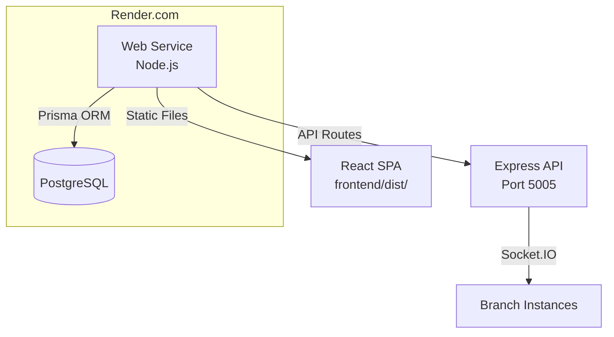

# Deployment Guide — Smart Enterprise Central Admin Portal

## Overview

The Central Admin Portal is deployed as a single web service that serves both the Express API and the React frontend static files.



## Deployment Options

### Option 1: Render.com (Recommended)

The project includes a `render.yaml` configuration for one-click deployment.

#### Setup

1. Connect GitHub repository to Render
2. Import `render.yaml` blueprint
3. Configure environment variables
4. Deploy

#### render.yaml Configuration

```yaml
services:
  - type: web
    name: smart-enterprise-admin
    env: node
    buildCommand: cd frontend && npm install && npm run build && cd ../backend && npm install
    startCommand: cd backend && npm start
    envVars:
      - key: NODE_ENV
        value: production
      - key: DATABASE_URL
        fromDatabase:
          name: smart-enterprise-db
          property: connectionString
      - key: JWT_SECRET
        generateValue: true
      - key: PORTAL_API_KEY
        generateValue: true
      - key: BOOTSTRAP_SECRET
        generateValue: true

databases:
  - name: smart-enterprise-db
    plan: free
```

#### Environment Variables

| Variable | Required | Description |
|----------|----------|-------------|
| `DATABASE_URL` | Yes | PostgreSQL connection string |
| `JWT_SECRET` | Yes | JWT signing secret (generate strong random value) |
| `PORTAL_API_KEY` | Yes | Master API key for branch authentication |
| `BOOTSTRAP_SECRET` | Yes | Shared secret for branch registration |
| `NODE_ENV` | Yes | Set to `production` |
| `PORT` | No | Render sets this automatically |
| `GITHUB_PAT` | No | GitHub personal access token for version management |
| `BRANCH_API_URL` | No | Default URL for branch update pushes |

### Option 2: Manual Deployment

#### Prerequisites

- Node.js 18+
- PostgreSQL 14+
- PM2 or similar process manager

#### Steps

```bash
# 1. Clone repository
git clone https://github.com/your-org/SmartEnterprise_AD.git
cd SmartEnterprise_AD

# 2. Install dependencies
cd frontend && npm install && npm run build
cd ../backend && npm install

# 3. Set up environment
cp .env.example .env
# Edit .env with your configuration

# 4. Initialize database
npx prisma generate
npx prisma db push

# 5. Start with PM2
pm2 start backend/server.js --name smart-admin
pm2 save
```

#### Nginx Reverse Proxy (Optional)

```nginx
server {
    listen 80;
    server_name admin.yourdomain.com;

    location / {
        proxy_pass http://localhost:5005;
        proxy_http_version 1.1;
        proxy_set_header Upgrade $http_upgrade;
        proxy_set_header Connection 'upgrade';
        proxy_set_header Host $host;
        proxy_cache_bypass $http_upgrade;
    }
}
```

---

## Database Migrations

### After Schema Changes

```bash
cd backend

# Generate updated Prisma Client
npx prisma generate

# Apply changes to database
npx prisma db push

# OR create a named migration
npx prisma migrate dev --name description_of_changes
```

### Production Migrations

```bash
cd backend

# Generate migration files
npx prisma migrate dev --name migration_name

# Apply in production
npx prisma migrate deploy
```

### Database Backup

Use the built-in backup endpoint:
```
POST /api/backup/create
```

Or use PostgreSQL tools:
```bash
pg_dump -U postgres -d smart_enterprise > backup_$(date +%Y%m%d).sql
```

---

## Production Checklist

### Pre-Deployment

- [ ] All environment variables configured
- [ ] `JWT_SECRET` is a strong random value (32+ characters)
- [ ] `PORTAL_API_KEY` is a strong random value
- [ ] `BOOTSTRAP_SECRET` is configured and shared with branch installers
- [ ] Database connection string points to production database
- [ ] `NODE_ENV=production`
- [ ] Frontend built (`npm run build`)
- [ ] Prisma client generated (`npx prisma generate`)
- [ ] Database schema applied (`npx prisma migrate deploy`)

### Post-Deployment

- [ ] Health check passes: `GET /health` returns `{"status": "OK"}`
- [ ] Admin user created automatically on first startup
- [ ] Default password logged — change immediately
- [ ] Socket.IO connections working (check branch connectivity)
- [ ] GitHub integration configured (if using version management)
- [ ] Monitoring/alerting set up
- [ ] Backup strategy in place

### Security

- [ ] HTTPS enabled (Render provides automatic SSL)
- [ ] CORS configured for production domains
- [ ] Rate limiting active (10 login attempts per 15 minutes)
- [ ] Environment variables not exposed in frontend build
- [ ] Database credentials not in version control

---

## Monitoring

### Health Check

```
GET /health
Response: {"status": "OK", "message": "Central Admin Portal API is running"}
```

### Application Logs

- **Pino logs:** Structured JSON logs via `backend/utils/logger.js`
- **Socket logs:** Prefixed with `[Socket]`, `[Sync]`
- **Error logs:** Captured in Express error handler

### Database Monitoring

```bash
# View recent sync operations
GET /api/sync/logs?limit=50

# View system status
GET /api/admin/system/status

# View recent logs
GET /api/admin/system/logs/recent
```

---

## Troubleshooting

### Branch Not Connecting

1. Verify `PORTAL_API_KEY` matches branch configuration
2. Check branch `apiKey` in database matches what branch is sending
3. Verify network connectivity (WebSocket port 5005 open)
4. Check `Branch.status` in database

### Sync Failures

1. Check `PortalSyncLog` for error details
2. Verify `SyncQueue` isn't growing unbounded
3. Check branch connectivity status
4. Review `CentralLog` for system-level errors

### Database Issues

```bash
# Open Prisma Studio for direct database access
cd backend
npx prisma studio

# Reset database (WARNING: destroys all data)
npx prisma db push --force-reset
```

### First-Time Admin Access

On first startup, a Super Admin user is created automatically:
- **Username:** `Admin@`
- **Password:** Auto-generated, logged on startup
- **Action:** Change password immediately after first login

If the admin user creation fails, check logs for errors and restart the server.
