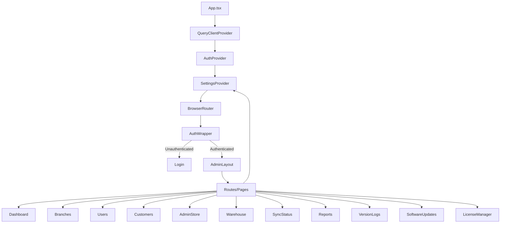

# Frontend Components — Smart Enterprise Central Admin Portal

**Framework:** React 19 + TypeScript 5.9
**Build:** Vite 7
**Styling:** Tailwind CSS 4 + Radix UI
**State:** TanStack React Query 5

## Architecture



## Pages (14)

| Component | File | Route | Description |
|-----------|------|-------|-------------|
| Login | `pages/Login.tsx` | `/login` | Admin authentication form |
| ForgotPassword | `pages/ForgotPassword.tsx` | `/forgot-password` | Password recovery flow |
| Dashboard | `pages/Dashboard.tsx` | `/` | Overview stats, charts, branch status |
| Branches | `pages/Branches.tsx` | `/branches` | Branch management, sync triggers |
| Users | `pages/Users.tsx` | `/users` | User CRUD, role management |
| Customers | `pages/Customers.tsx` | `/customers` | Customer directory |
| AdminStore | `pages/AdminStore.tsx` | `/admin-store` | Asset inventory, stock management |
| Warehouse | `pages/Warehouse.tsx` | `/warehouse` | Machine/SIM warehouse inventory |
| SyncStatus | `pages/SyncStatus.tsx` | `/sync-status` | Real-time sync monitoring |
| Reports | `pages/Reports.tsx` | `/reports` | Financial and inventory reports |
| VersionLogs | `pages/VersionLogs.tsx` | `/version-logs` | Branch version tracking |
| SoftwareUpdates | `pages/SoftwareUpdates.tsx` | `/software-updates` | GitHub release management |
| LicenseManager | `pages/LicenseManager.tsx` | `/license-manager` | License CRUD and audit |
| Settings | `pages/Settings.tsx` | `/settings` | System configuration (8 tabs) |

## Settings Tabs (8)

| Tab | File | Description |
|-----|------|-------------|
| Appearance | `components/settings/AppearanceTab.tsx` | Theme, font, UI preferences |
| ClientTypes | `components/settings/ClientTypesTab.tsx` | Customer type management |
| MachineParameters | `components/settings/MachineParametersTab.tsx` | POS machine model definitions |
| Permissions | `components/settings/PermissionsTab.tsx` | RBAC permission matrix |
| PortalSyncLogs | `components/settings/PortalSyncLogsTab.tsx` | Sync operation history |
| Security | `components/settings/SecurityTab.tsx` | MFA, password policies |
| SpareParts | `components/settings/SparePartsTab.tsx` | Spare part catalog management |
| SystemParams | `components/settings/SystemParamsTab.tsx` | Global system parameters |

## UI Components (17)

Located in `components/ui/` — Radix UI primitives with Tailwind styling.

| Component | File | Description |
|-----------|------|-------------|
| Alert Dialog | `alert-dialog.tsx` | Confirmation dialogs |
| Alert | `alert.tsx` | Status messages |
| Badge | `badge.tsx` | Status labels |
| Button | `button.tsx` | Button variants (cva) |
| Card | `card.tsx` | Content containers |
| Checkbox | `checkbox.tsx` | Checkbox inputs |
| Data Table | `data-table.tsx` | TanStack Table wrapper |
| Dialog | `dialog.tsx` | Modal dialogs |
| Dropdown Menu | `dropdown-menu.tsx` | Context menus |
| Input | `input.tsx` | Text inputs |
| Label | `label.tsx` | Form labels |
| Progress | `progress.tsx` | Progress bars |
| Select | `select.tsx` | Dropdown selects |
| Sheet | `sheet.tsx` | Slide-out panels |
| Table | `table.tsx` | HTML table styling |
| Tabs | `tabs.tsx` | Tab navigation |
| Textarea | `textarea.tsx` | Multi-line inputs |

## Layout Components

| Component | File | Description |
|-----------|------|-------------|
| AdminLayout | `components/AdminLayout.tsx` | Main authenticated layout with sidebar |
| Modal | `components/Modal.tsx` | Generic modal wrapper |
| BranchInventoryModal | `components/BranchInventoryModal.tsx` | Branch inventory viewer |
| DatabaseAdmin | `components/DatabaseAdmin.tsx` | Database management interface |

## Contexts (3)

| Context | File | Provides |
|---------|------|----------|
| AuthContext | `context/AuthContext.tsx` | `user`, `isLoading`, `login()`, `logout()` |
| SettingsContext | `context/SettingsContext.tsx` | Theme, font, UI preferences |
| SocketContext | `context/SocketContext.tsx` | Socket.IO connection, branch status |

## Custom Hooks (3)

| Hook | File | Purpose |
|------|------|---------|
| useApiMutation | `hooks/useApiMutation.ts` | TanStack Query mutation wrapper |
| useCustomerData | `hooks/useCustomerData.ts` | Customer data fetching |
| usePushNotifications | `hooks/usePushNotifications.ts` | Push notification setup |

## API Clients (23)

Located in `api/`. All use axios with JWT interceptor.

| Client | File | Endpoints |
|--------|------|-----------|
| adminClient | `adminClient.ts` | Base axios instance with JWT interceptor |
| baseClient | `baseClient.ts` | Base HTTP client configuration |
| client | `client.ts` | Generic API client |
| authApi | `authApi.ts` | Login, password reset, preferences |
| branchApi | `branchApi.ts` | Branch CRUD, registration |
| userApi | `userApi.ts` | User management |
| customerApi | `customerApi.ts` | Customer CRUD |
| dashboardApi | `dashboardApi.ts` | Dashboard statistics |
| inventoryApi | `inventoryApi.ts` | Inventory queries |
| warehouseApi | `warehouseApi.ts` | Warehouse management |
| machineApi | `machineApi.ts` | Machine operations |
| maintenanceApi | `maintenanceApi.ts` | Maintenance requests |
| paymentApi | `paymentApi.ts` | Payment records |
| transferApi | `transferApi.ts` | Transfer orders |
| simApi | `simApi.ts` | SIM card management |
| reportApi | `reportApi.ts` | Reports generation |
| settingsApi | `settingsApi.ts` | System settings |
| permissionApi | `permissionApi.ts` | RBAC permissions |
| notificationApi | `notificationApi.ts` | Notifications |
| backupApi | `backupApi.ts` | Backup operations |
| adminStoreApi | `adminStoreApi.ts` | Admin store operations |
| aiApi | `aiApi.ts` | AI assistant |
| requestApi | `requestApi.ts` | Generic request helper |

## Key Patterns

### Data Fetching
```typescript
// Custom hook with React Query
const useCustomers = (branchId: string) => {
  return useQuery({
    queryKey: ['customers', branchId],
    queryFn: () => apiClient.getCustomers(branchId)
  });
};

// Usage in component
const { data, isLoading, error } = useCustomers(branchId);
```

### API Client
```typescript
// adminClient.ts — JWT interceptor
const adminClient = axios.create({
  baseURL: import.meta.env.VITE_API_URL || '/api',
});

adminClient.interceptors.request.use((config) => {
  const token = localStorage.getItem('portal_token');
  if (token) {
    config.headers.Authorization = `Bearer ${token}`;
  }
  return config;
});
```

### Auth Flow
```typescript
// AuthWrapper in App.tsx
function AuthWrapper() {
  const { user, isLoading } = useAuth();
  
  if (isLoading) return <LoadingSpinner />;
  if (!user) return <Login />;
  
  return (
    <AdminLayout>
      <Routes>
        <Route path="/" element={<Dashboard />} />
        {/* ... other routes */}
      </Routes>
    </AdminLayout>
  );
}
```

### Styling
```tsx
// Tailwind + cva for variants
import { cva } from 'class-variance-authority';
import { cn } from '@/lib/utils';

const buttonVariants = cva(
  'inline-flex items-center justify-center rounded-md',
  {
    variants: {
      variant: { default: 'bg-primary', outline: 'border' },
      size: { default: 'h-10 px-4', sm: 'h-8 px-3' },
    },
    defaultVariants: { variant: 'default', size: 'default' },
  }
);
```

## Libraries

| Library | Version | Purpose |
|---------|---------|---------|
| React | 19.x | UI framework |
| React Router DOM | 7.x | Client-side routing |
| TanStack React Query | 5.x | Server state management |
| TanStack Table | 8.x | Data tables |
| Radix UI | 1.x | Accessible UI primitives |
| Tailwind CSS | 4.x | Utility-first CSS |
| Framer Motion | 12.x | Animations |
| Recharts | 3.x | Charts |
| Lucide React | 0.x | Icons |
| axios | 1.x | HTTP client |
| react-hot-toast | 2.x | Toast notifications |
| Socket.IO Client | 4.x | Real-time communication |
| xlsx | 0.x | Excel import |
