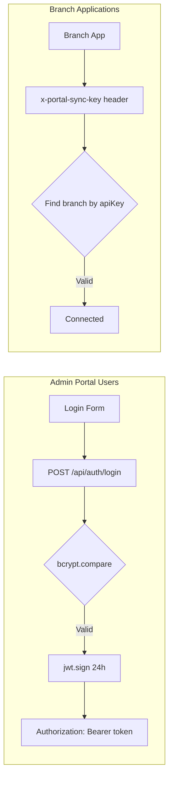

# Security & Authentication — Smart Enterprise Central Admin Portal

## Authentication Architecture

### Dual Authentication System

The portal supports two distinct authentication methods:



### JWT Authentication (Admin Users)

**Login Flow:**
1. User submits credentials to `POST /api/auth/login`
2. Server validates against `AdminUser` table
3. Password verified with `bcrypt.compare()`
4. JWT signed with payload: `{ id, username, role }`
5. Token expires in 24 hours
6. Client stores token in `localStorage` as `portal_token`

**Token Verification:**
```javascript
// middleware/auth.js
const adminAuth = (req, res, next) => {
    const token = req.cookies?.token || req.headers.authorization?.split(' ')[1];
    const decoded = jwt.verify(token, process.env.JWT_SECRET);
    req.admin = decoded;
    next();
};
```

**Role-Based Access:**
```javascript
const requireSuperAdmin = (req, res, next) => {
    if (!req.admin || req.admin.role !== 'SUPER_ADMIN') {
        return res.status(403).json({ error: 'Super Admin access required' });
    }
    next();
};
```

### API Key Authentication (Branch Apps)

**Connection Methods:**
- **HTTP:** `x-portal-sync-key` header
- **Socket.IO:** `auth.apiKey` or `headers['x-api-key']` or `query.apiKey`

**Validation Flow:**
1. Branch sends API key with request
2. Server queries `Branch` table for matching `apiKey`
3. If not found, checks against `PORTAL_API_KEY` master key
4. Updates branch `lastSeen` and `status: ONLINE`
5. Branch joins room: `branch_{id}`

**Key Generation:**
```javascript
function generateAPIKey() {
    return 'sk_' + crypto.randomBytes(32).toString('hex');
}
```

### Bootstrap Secret (Branch Registration)

New branches register using a shared bootstrap secret:
1. Branch sends `bootstrapSecret` from environment
2. Server validates against `BOOTSTRAP_SECRET` env var
3. Auto-generates branch code and API key
4. Creates initial admin user for branch

---

## Multi-Factor Authentication (MFA)

### MFA Endpoints

| Endpoint | Auth | Description |
|----------|------|-------------|
| `GET /api/mfa/status` | JWT | Check MFA status |
| `POST /api/mfa/setup` | JWT | Generate TOTP secret + QR code |
| `POST /api/mfa/verify-setup` | JWT | Verify TOTP code to enable MFA |
| `POST /api/mfa/disable` | JWT | Disable MFA |
| `POST /api/mfa/verify` | None | Verify TOTP during login |
| `POST /api/mfa/recovery-codes` | JWT | Generate recovery codes |
| `POST /api/mfa/verify-recovery` | None | Login with recovery code |

### MFA Storage

```prisma
model AdminUser {
  mfaEnabled       Boolean  @default(false)
  mfaSetupPending  Boolean  @default(false)
  mfaTempSecret    String?
  mfaRecoveryCodes String?
}
```

**Flow:**
1. `setup` → Generates TOTP secret via `speakeasy`, stores in `mfaTempSecret`
2. `verify-setup` → User enters code from authenticator app, enables MFA
3. Recovery codes generated and stored in `mfaRecoveryCodes`
4. Login flow checks `mfaEnabled`, requires TOTP verification

---

## Role-Based Access Control (RBAC)

### Roles

| Role | Level | Access |
|------|-------|--------|
| `SUPER_ADMIN` | Highest | Full system access |
| `MANAGEMENT` | High | Management operations |
| `BRANCH_ADMIN` | High | Branch administration |
| `ACCOUNTANT` | Medium | Financial operations |
| `BRANCH_MANAGER` | Medium | Branch management |
| `CS_SUPERVISOR` | Medium | Customer service supervision |
| `CS_AGENT` | Low | Customer service operations |
| `BRANCH_TECH` | Low | Technical operations |

### Permission Model

Permissions stored in `RolePermission` model:

```prisma
model RolePermission {
  role           String
  permissionType String
  permissionKey  String
  isAllowed      Boolean  @default(true)

  @@unique([role, permissionType, permissionKey])
}
```

**Permission Check:**
```typescript
// permissionApi.ts
const checkPermission = async (role: string, permissionKey: string) => {
  const permission = await prisma.rolePermission.findUnique({
    where: { role_permissionType_permissionKey: { role, permissionType, permissionKey } }
  });
  return permission?.isAllowed ?? false;
};
```

---

## Password Security

### Password Policies

| Policy | Implementation |
|--------|---------------|
| Hashing | bcrypt with salt rounds 10 |
| History | `PasswordHistory` table tracks previous hashes |
| Force Change | `mustChangePassword` flag |
| Account Lockout | `AccountLockout` model tracks failed attempts |
| Reset Tokens | Time-limited tokens (15 minutes) |

### Account Lockout

```prisma
model AccountLockout {
  userId            String    @unique
  failedAttempts    Int       @default(0)
  lastFailedAttempt DateTime?
  lockedUntil       DateTime?
}
```

---

## Rate Limiting

### Login Rate Limiter

```javascript
const loginLimiter = rateLimit({
    windowMs: 15 * 60 * 1000,  // 15 minutes
    max: process.env.NODE_ENV !== 'production' ? 1000 : 10,
    message: { error: 'Too many login attempts, please try again after 15 minutes' }
});

app.use('/api/auth', loginLimiter, authRoutes);
```

---

## Security Headers

### Helmet Configuration

```javascript
app.use(helmet({
    hsts: false,                    // Disabled for HTTP branch connections
    contentSecurityPolicy: false    // Disabled for SPA serving
}));
```

### CORS

```javascript
app.use(cors({ origin: true, credentials: true }));
```

### Request Size Limits

```javascript
app.use(express.json({ limit: '50mb' }));
app.use(express.urlencoded({ limit: '50mb', extended: true }));
```

---

## Audit Logging

### Audit Trail

All significant actions logged to `AuditLog` model:

```prisma
model AuditLog {
  userId     String?
  userName   String?
  entityType String
  entityId   String?
  action     String
  details    String?
  ipAddress  String?
  userAgent  String?
}
```

### License Audit

License operations tracked in `LicenseAudit`:
- `CREATED`, `ACTIVATED`, `VERIFIED`, `SUSPENDED`, `REVOKED`
- `HWID_MISMATCH` — Security event

### Sync Audit

All sync operations logged to `PortalSyncLog`:
- `PULL`, `PUSH`, `CONNECT`, `DISCONNECT`
- Status: `SUCCESS`, `FAILED`, `PENDING`
- Item count and error details

---

## Environment Security

### Required Secrets

| Variable | Purpose | Sensitivity |
|----------|---------|-------------|
| `JWT_SECRET` | JWT signing | Critical |
| `PORTAL_API_KEY` | Master branch key | Critical |
| `BOOTSTRAP_SECRET` | Branch registration | High |
| `DATABASE_URL` | Database connection | Critical |
| `GITHUB_PAT` | GitHub API access | High |

### Best Practices

1. Never commit `.env` files
2. Use strong random values for secrets
3. Rotate `JWT_SECRET` periodically (invalidates all sessions)
4. Rotate `PORTAL_API_KEY` if compromised
5. Use HTTPS in production
6. Monitor `AuditLog` for suspicious activity

---

## Security Checklist

- [x] Password hashing (bcrypt)
- [x] JWT authentication
- [x] MFA support (TOTP)
- [x] Rate limiting on login
- [x] Account lockout mechanism
- [x] Password history tracking
- [x] Role-based permissions
- [x] Audit logging
- [x] Helmet security headers
- [x] CORS configuration
- [x] Request size limits
- [x] API key authentication for branches
- [x] HWID binding for branches
- [x] Bootstrap secret for registration
- [x] License HWID verification
- [ ] CSP headers (currently disabled)
- [ ] HSTS (currently disabled)
- [ ] Input sanitization (Zod validation on some routes)
- [ ] SQL injection prevention (Prisma parameterized queries)
