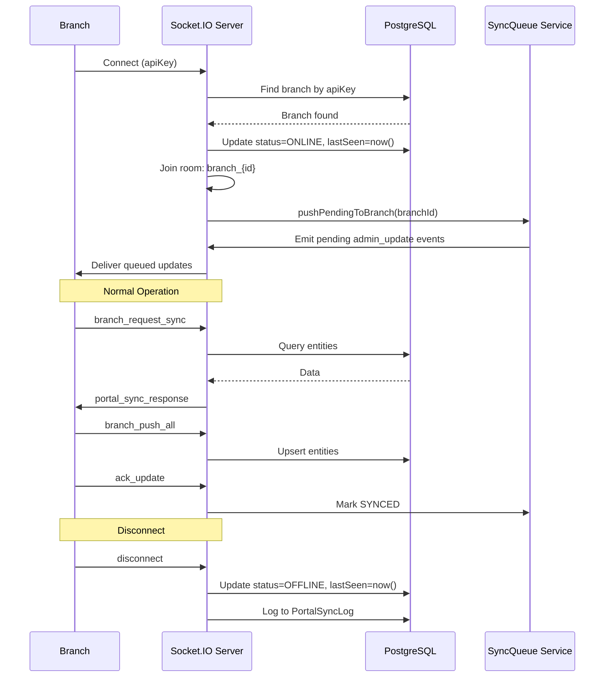

# Socket.IO Event Reference — Smart Enterprise Central Admin Portal

**Server:** Socket.IO 4.x
**Entry Point:** `backend/src/sockets/admin.socket.js`
**Port:** 5005 (shared with HTTP)

## Connection Authentication

Socket.IO connections use dual authentication:

```mermaid
graph LR
    Client[Client] --> Auth{Auth Check}
    Auth -->|apiKey| Branch[Branch Connection]
    Auth -->|token| Admin[Admin Connection]
    
    Branch --> JoinRoom[join branch_{id}]
    Branch --> PushPending[pushPendingToBranch]
    
    Admin --> VerifyJWT[jwt.verify]
```

### Branch Connection
```javascript
// Connect with API key
const socket = io(PORTAL_URL, {
  auth: { apiKey: 'sk_abc123...' },
  query: { branchCode: 'BR001', branchUrl: 'http://192.168.1.100:5002' }
});
```

### Admin Connection
```javascript
// Connect with JWT token
const socket = io(PORTAL_URL, {
  auth: { token: 'jwt_token_here' }
});
```

---

## Branch-to-Portal Events

Events emitted by branch applications to the portal.

### `branch_identify`
Branch confirms its identity after connection.

**Emitted by:** Branch
**Payload:**
```json
{
  "branchCode": "BR001"
}
```

### `branch_request_sync`
Branch requests data from the portal (initial sync or refresh).

**Emitted by:** Branch
**Payload:**
```json
{
  "branchCode": "BR001",
  "entities": ["branches", "users", "machineParameters", "spareParts", "globalParameters"]
}
```

**Portal Response:** Emits `portal_sync_response` back to the requesting branch with:
- `branches` — All active branches
- `users` — Users for the requesting branch
- `machineParameters` — All machine parameters
- `masterSpareParts` — Global spare part catalog
- `sparePartPriceLogs` — Price change history
- `globalParameters` — System-wide settings

### `ack_update`
Branch acknowledges receipt and processing of a sync queue item.

**Emitted by:** Branch
**Payload:**
```json
{
  "queueId": "sync_queue_item_id"
}
```

**Effect:** Updates `SyncQueue` record status from `PENDING` to `SYNCED`.

### `branch_user_update`
Branch sends user changes upward to the portal (upward sync).

**Emitted by:** Branch
**Payload:**
```json
{
  "branchCode": "BR001",
  "user": {
    "id": "user_id",
    "uid": "uid123",
    "username": "john",
    "email": "john@branch.local",
    "displayName": "John Doe",
    "role": "CS_AGENT",
    "isActive": true,
    "_deleted": false
  }
}
```

**Portal Behavior:**
- If `_deleted: true` → Deactivates user (`isActive: false`)
- If existing user → Updates fields
- If new user → Creates user in portal

**Logging:** Records to `UserSyncLog` table.

### `branch_push_all`
Full data push from branch to portal (comprehensive upward sync).

**Emitted by:** Branch
**Payload:**
```json
{
  "users": [...],
  "machineParams": [...],
  "spareParts": [...]
}
```

**Portal Behavior:**
1. Syncs users (create/update/deactivate)
2. Machine parameters — **DISABLED** (portal is source of truth)
3. Spare parts — **DISABLED** (portal is source of truth)

### `branch_inventory_push`
Branch pushes full inventory snapshot to portal.

**Emitted by:** Branch
**Payload:**
```json
{
  "branchCode": "BR001",
  "inventory": [
    { "partId": "part_id_1", "quantity": 50 },
    { "partId": "part_id_2", "quantity": 25 }
  ]
}
```

**Portal Behavior:**
- Uses Prisma transaction for atomic batch upsert
- Updates `BranchSparePart` records
- Logs to `PortalSyncLog`

### `branch_data_push`
Branch pushes comprehensive reporting data to portal.

**Emitted by:** Branch
**Payload:**
```json
{
  "branchCode": "BR001",
  "entities": {
    "machines": [...],
    "sales": [...],
    "sims": [...],
    "movements": [...],
    "payments": [...]
  }
}
```

**Portal Behavior:** Upserts each entity type:
- `machines` → `WarehouseMachine` (by `serialNumber`)
- `sales` → `MachineSale` (by `id`)
- `sims` → `WarehouseSim` (by `serialNumber`)
- `movements` → `StockMovement` (by `id`)
- `payments` → `Payment` (by `id`)

### `branch_stock_response`
Branch responds to admin's stock request for a specific part.

**Emitted by:** Branch
**Payload:**
```json
{
  "requestId": "unique_request_id",
  "branchCode": "BR001",
  "partId": "part_id",
  "stock": 50
}
```

**Portal Behavior:** Forwards response to admin via `admin_branch_stock_response`.

### `disconnect`
Branch disconnects (handled automatically).

**Portal Behavior:**
- Updates branch status to `OFFLINE`
- Updates `lastSeen` timestamp
- Logs to `PortalSyncLog`

---

## Portal-to-Branch Events

Events emitted by the portal to branch applications.

### `portal_directive`
Commands sent from portal to branches.

**Emitted by:** Portal (admin routes, socket handlers)
**Target:** Specific branch room (`branch_{id}`)
**Payload:**
```json
{
  "type": "SYSTEM_DIRECTIVE",
  "action": "REQUEST_FULL_SYNC",
  "timestamp": "2026-04-01T10:00:00.000Z"
}
```

**Supported Actions:**
| Action | Trigger | Description |
|--------|---------|-------------|
| `REQUEST_FULL_SYNC` | Admin triggers sync | Requests branch to push all data |
| `PUSH_FULL_INVENTORY` | Admin pulls inventory | Requests branch to push inventory |
| `SYSTEM_DIRECTIVE` | Various | Generic system command |

### `portal_sync_response`
Data response to branch sync request.

**Emitted by:** Portal
**Target:** Requesting branch
**Payload:**
```json
{
  "success": true,
  "data": {
    "branches": [...],
    "users": [...],
    "machineParameters": [...],
    "masterSpareParts": [...],
    "sparePartPriceLogs": [...],
    "globalParameters": [...]
  }
}
```

### `admin_update`
Real-time update pushed to branches via SyncQueue service.

**Emitted by:** `syncQueueService.enqueueUpdate()`
**Target:** All active branches (or specific branch)
**Payload:**
```json
{
  "queueId": "queue_item_id",
  "entityType": "spareParts",
  "action": "UPDATE",
  "payload": { "id": "...", "name": "...", "cost": 50 }
}
```

**Delivery:**
- Online branches: Emitted immediately
- Offline branches: Queued, delivered on reconnect via `pushPendingToBranch()`

### `admin_request_branch_stock`
Admin requests stock information for a specific part from all branches.

**Emitted by:** Portal (admin socket handler)
**Target:** All connected branches (broadcast)
**Payload:**
```json
{
  "partId": "part_id",
  "requestId": "unique_request_id"
}
```

### `admin_branch_stock_response`
Stock data forwarded back to admin from branch responses.

**Emitted by:** Portal (forwarding branch responses)
**Target:** Admin user
**Payload:**
```json
{
  "requestId": "unique_request_id",
  "branchCode": "BR001",
  "partId": "part_id",
  "stock": 50
}
```

---

## Connection Lifecycle



---

## Socket Rooms

| Room Pattern | Members | Purpose |
|-------------|---------|---------|
| `branch_{branchId}` | Branch app socket | Targeted communication to specific branch |
| All sockets | Broadcast | Admin requests sent to all branches |

---

## Error Handling

| Scenario | Behavior |
|----------|----------|
| Invalid API key | Connection rejected with `Authentication error` |
| Invalid JWT token | Connection rejected with `Authentication error` |
| Branch not found | Connection rejected |
| Sync error | Logged to `CentralLog` and `PortalSyncLog` |
| Queue item error | Status remains `PENDING`, retried on reconnect |
| Disconnect | Branch status set to `OFFLINE`, logged |

---

## Security Notes

1. **API Key Priority:** Branch connections always use API key authentication first (non-expiring)
2. **JWT Fallback:** Admin connections use JWT tokens (24h expiry)
3. **Master Key:** `PORTAL_API_KEY` env var can authenticate any branch if combined with `branchCode` query param
4. **No Admin Actions from Branch:** Branch sockets cannot trigger admin-only events (validated by `socket.isAdmin` check)
5. **HWID Binding:** Branch API keys are bound to `authorizedHWID` for additional security
