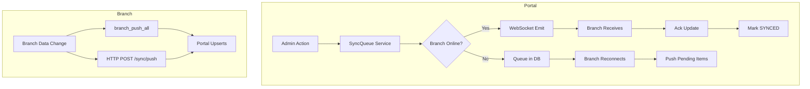
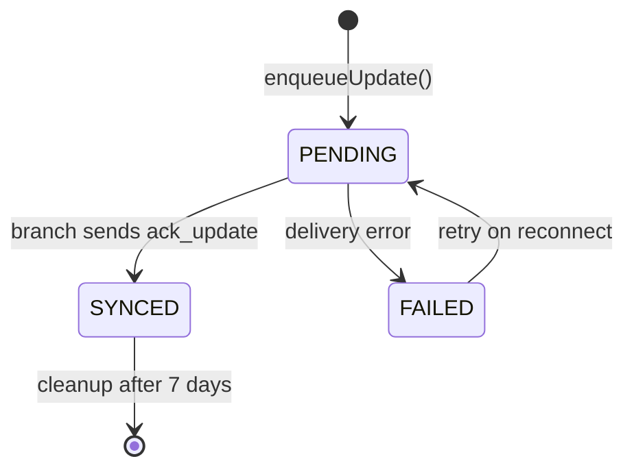
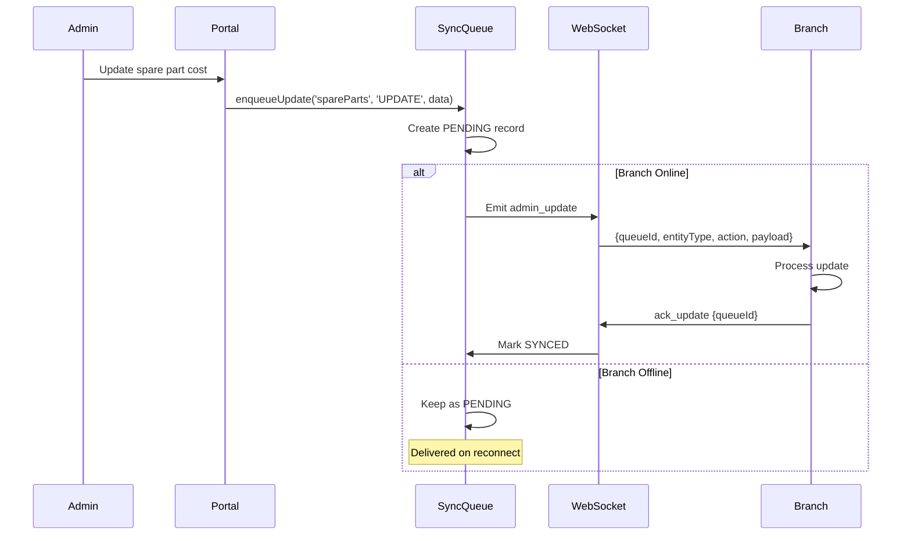

# Sync Engine Architecture — Smart Enterprise Central Admin Portal

## Overview

The sync engine is the core mechanism that keeps the Central Admin Portal and all branch instances synchronized. It uses a **hybrid approach** combining WebSocket real-time delivery with HTTP REST fallback and a persistent queue for offline resilience.



## SyncQueue Service

**File:** `backend/src/services/syncQueue.service.js`

### Core Functions

#### `enqueueUpdate(entityType, action, payloadObj)`
Queues an update for all active branches.

```javascript
// 1. Save to SyncQueue table
const queueItem = await prisma.syncQueue.create({
    data: { branchId, entityType, action, payload: JSON.stringify(payloadObj), status: 'PENDING' }
});

// 2. If branch online, emit immediately via WebSocket
if (branch.status === 'ONLINE') {
    io.to(`branch_${branch.id}`).emit('admin_update', {
        queueId: queueItem.id,
        entityType,
        action,
        payload: payloadObj
    });
}
```

#### `pushPendingToBranch(branchId)`
Delivers all queued items when a branch reconnects.

```javascript
const pendingItems = await prisma.syncQueue.findMany({
    where: { branchId, status: 'PENDING' },
    orderBy: { createdAt: 'asc' }  // FIFO order
});

for (const item of pendingItems) {
    io.to(`branch_${branchId}`).emit('admin_update', { ... });
}
```

#### `startCleanupJob()`
Daily cleanup of old synced items.

```javascript
// Delete SYNCED items older than 7 days
setInterval(async () => {
    const sevenDaysAgo = new Date(Date.now() - 7 * 24 * 60 * 60 * 1000);
    await prisma.syncQueue.deleteMany({
        where: { status: 'SYNCED', updatedAt: { lt: sevenDaysAgo } }
    });
}, 24 * 60 * 60 * 1000);
```

### Queue States



---

## Downward Sync (Portal → Branch)

### Flow



### Trigger Points

Updates are queued when admin performs:
- Spare part CRUD operations
- Parameter changes (machine, POS, global)
- User management
- Settings changes
- Permission updates

All relevant routes call `syncQueueService.enqueueUpdate()` after database operations.

---

## Upward Sync (Branch → Portal)

### WebSocket Upward Sync

#### `branch_push_all`
Full data push from branch.

**Data Types:**
- `users` — Branch user accounts
- `machineParams` — Machine parameters (DISABLED — portal is source of truth)
- `spareParts` — Spare part inventory (DISABLED — portal is source of truth)

#### `branch_inventory_push`
Inventory snapshot push.

**Data:** Array of `{ partId, quantity }` objects
**Processing:** Batch upsert via Prisma transaction

#### `branch_data_push`
Comprehensive reporting data.

**Data Types:**
- `machines` — Warehouse machines
- `sales` — Machine sales
- `sims` — Warehouse SIMs
- `movements` — Stock movements
- `payments` — Financial payments

#### `branch_user_update`
Individual user changes.

**Processing:**
- `_deleted: true` → Deactivate user
- Existing user → Update fields
- New user → Create

### HTTP Upward Sync

#### `POST /api/sync/push`
Batch entity push via HTTP (fallback or preferred method).

**Supported Entities:**
1. `customers` — Upsert by `id`
2. `posMachines` — Upsert by `id`
3. `users` — Upsert by `id` (or deactivate if `_deleted`)
4. `payments` — Upsert by `id`
5. `maintenanceRequests` — Upsert by `id`
6. `spareParts` — Upsert `BranchSparePart` by `[branchId, partId]`
7. `warehouseMachines` — Upsert by `serialNumber`
8. `simCards` — Upsert by `serialNumber`

**Response:**
```json
{
  "stats": { "customers": 5, "posMachines": 12, ... },
  "success": true,
  "errorCount": 0
}
```

---

## Pull Sync (Branch Requests Data)

### `POST /api/sync/request-sync` (HTTP)

Branch requests specific entities from portal.

**Request:**
```json
{
  "entities": ["branches", "users", "machineParameters", "spareParts", "globalParameters"]
}
```

**Response:**
```json
{
  "success": true,
  "data": {
    "branches": [...],
    "users": [...],
    "machineParameters": [...],
    "masterSpareParts": [...],
    "sparePartPriceLogs": [...],
    "globalParameters": [...]
  }
}
```

### `branch_request_sync` (WebSocket)

Same data, delivered via WebSocket. Portal responds with `portal_sync_response`.

---

## Admin-Initiated Sync

### Trigger Full Sync

```
POST /api/branches/:id/trigger-sync
```

**Flow:**
1. Admin triggers sync for specific branch
2. Portal emits `portal_directive` with `action: REQUEST_FULL_SYNC`
3. Branch receives directive and pushes all data upward

### Pull Inventory

```
POST /api/branches/:id/pull-inventory
```

**Flow:**
1. Admin requests inventory from specific branch
2. Portal emits `portal_directive` with `action: PUSH_FULL_INVENTORY`
3. Branch responds with `branch_inventory_push`

### Request Branch Stock

**WebSocket Flow:**
1. Admin emits `request_branch_stock` with `{ partId, requestId }`
2. Portal broadcasts `admin_request_branch_stock` to all branches
3. Each branch responds with `branch_stock_response`
4. Portal forwards responses to admin via `admin_branch_stock_response`

---

## Sync Logging

### PortalSyncLog

All sync operations logged:

| Field | Description |
|-------|-------------|
| type | `PULL`, `PUSH`, `CONNECT`, `DISCONNECT` |
| status | `SUCCESS`, `FAILED`, `PENDING` |
| message | Human-readable description (Arabic supported) |
| itemCount | Number of items synced |
| details | Error details (if failed) |

### CentralLog

System-level log for sync events:
```javascript
await prisma.centralLog.create({
    data: {
        level: errors.length > 0 ? 'WARNING' : 'INFO',
        message: `Branch Data Push: ${totalItems} synced, ${errors.length} failed`,
        source: branch.code,
        context: JSON.stringify({ stats, errorCount })
    }
});
```

### UserSyncLog

Tracks user sync operations between branch and portal:
- `action`: `CREATED`, `SYNCED`, `DELETED`
- `source`: `BRANCH` or `PORTAL`
- `status`: `SUCCESS` or `FAILED`

---

## Source of Truth Hierarchy

| Data Type | Source | Sync Direction |
|-----------|--------|---------------|
| Spare parts catalog | Portal | Portal → Branch |
| Machine parameters | Portal | Portal → Branch |
| Global parameters | Portal | Portal → Branch |
| Software versions | Portal | Portal → Branch |
| Customers | Branch | Branch → Portal |
| POS machines | Branch | Branch → Portal |
| Maintenance requests | Branch | Branch → Portal |
| Payments | Branch | Branch → Portal |
| Warehouse inventory | Branch | Branch → Portal |
| SIM cards | Branch | Branch → Portal |
| Users | Both | Bidirectional |
| Sales | Branch | Branch → Portal |
| Stock movements | Branch | Branch → Portal |

---

## Reliability Guarantees

1. **At-least-once delivery:** Queue items persist until acknowledged
2. **FIFO ordering:** Pending items delivered in creation order
3. **Offline resilience:** Queue accumulates during disconnection
4. **Automatic cleanup:** Synced items removed after 7 days
5. **Error tracking:** Failed items remain in queue for retry
6. **Atomic operations:** Batch updates use Prisma transactions

---

## Performance Considerations

| Scenario | Strategy |
|----------|----------|
| Large inventory push | Batch upsert in transaction |
| Many offline branches | Queue per branch, independent delivery |
| Frequent small updates | Immediate WebSocket emit if online |
| Full sync requests | Use HTTP endpoint for large payloads |
| Stock queries | Request-response pattern, not full sync |

---

## Monitoring

### Sync Health Indicators

1. **Queue depth:** Count of `PENDING` items per branch
2. **Last sync time:** `PortalSyncLog` most recent entry
3. **Branch status:** `ONLINE` / `OFFLINE` in `Branch` table
4. **Error rate:** Failed sync operations in logs
5. **Sync duration:** Time between push request and completion

### Admin Dashboard

The `SyncStatus` page displays:
- Connected branches
- Recent sync operations
- Queue status
- Error history
